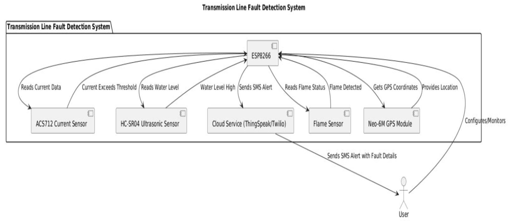
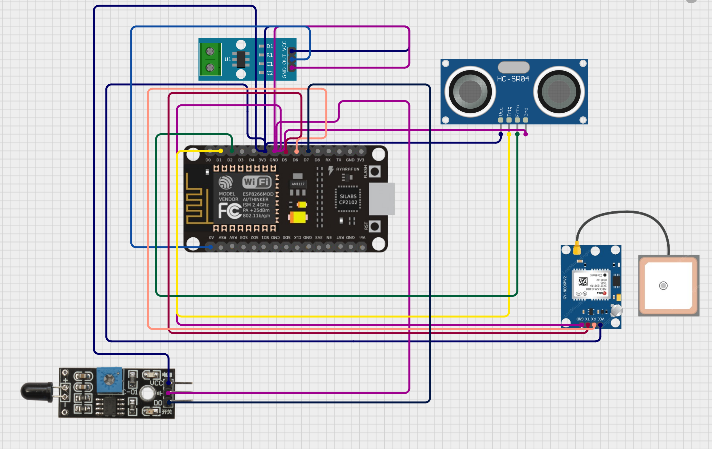

# Transmission Line Fault Detection System

An **IoT-powered intelligent monitoring system** for **real-time fault detection** in transmission lines. This project leverages sensors, cloud computing, and automated communication to provide a safer, more reliable, and efficient power distribution infrastructure.

---

## Project Overview

The Transmission Line Fault Detection System is built to automatically detect and report various faults in a power transmission system. It uses a combination of sensors to monitor the electrical current, fire risks, and flood levels near transformers. Data is transmitted to a cloud server (ThingSpeak) and analyzed in real-time. When a fault is detected, it sends an SMS alert with GPS coordinates via Twilio API to facilitate rapid response.

---

## Features

* **Multi-sensor Fault Detection:** Monitors short circuits, fire hazards, and flood risks.
* **Real-Time Alerts:** SMS notifications with GPS location are sent immediately upon fault detection.
* **Cloud Logging:** All sensor data is uploaded to ThingSpeak for analysis and historical review.
* **Remote Monitoring:** Fault status can be accessed and managed remotely.
* **Automation:** Power can be automatically shut off in hazardous conditions.

---

## Problem Statement

Manual fault detection in power lines leads to delays, high maintenance costs, and safety hazards. Environmental conditions like floods and fires further complicate monitoring. There is a need for an **automated, real-time, scalable system** that can detect, locate, and report faults instantly, reducing downtime and risks.

---

## Objectives

* Detect short circuits using current sensors.
* Identify fire hazards with flame sensors.
* Monitor flood conditions with ultrasonic sensors.
* Pinpoint the exact location of faults using a GPS module.
* Send alerts via SMS using Twilio API.
* Visualize and analyze data using ThingSpeak.

---

## System Architecture


---

## Hardware Components

* **ESP8266 (NodeMCU):** Wi-Fi microcontroller for real-time data transmission.
* **ACS712 Current Sensor:** Detects overcurrent or short circuits.
* **Flame Sensor:** Monitors fire hazards.
* **HC-SR04 Ultrasonic Sensor:** Measures water level for flood detection.
* **Neo-6M GPS Module:** Captures real-time location coordinates.


---

## Software Components

* **Arduino IDE:** Firmware development for ESP8266.
* **ThingSpeak:** Cloud dashboard for data logging and analysis.
* **MATLAB Analysis:** Used to process ThingSpeak data and trigger alerts.
* **Twilio API:** Sends SMS alerts with fault type and GPS location.

---

## Working Principle

### Sensor Monitoring:

* **Current Sensor:** Detects abnormal current (e.g., >12A implies short circuit).
* **Flame Sensor:** Reads fire presence (0 = fire detected).
* **Ultrasonic Sensor:** Measures distance from the surface. <10 cm means high water level.

### ESP8266 Operation:

* Reads data from sensors.
* Sends sensor values and GPS coordinates to ThingSpeak.
* Triggers a relay or alarm if a threshold is breached.

### Fault Detection Logic:

* If current > threshold → Short Circuit
* If flame = 0 → Fire
* If water level < threshold → Flood

---

## Cloud Integration

**ThingSpeak Channel Fields:**

1. Field 1 – Current Sensor Value
2. Field 2 – Flame Sensor Status
3. Field 3 – Water Level (Ultrasonic Distance)
4. Field 4 – Latitude
5. Field 5 – Longitude

**Data Analysis Flow:**

* MATLAB reads the latest sensor values.
* Evaluates if any parameter exceeds limits.
* Constructs a warning message including the Google Maps link.

---

## Alert System

**Twilio SMS Trigger** (via MATLAB):

* Automatically sends SMS to predefined numbers.
* Message example:

  ```
  ALERT! Fire & Flood detected!
  Location: https://www.google.com/maps?q=12.9716,77.5946
  ```
* Different alerts for single/multiple fault detections.

---

## Implementation

### Arduino Code:

* Written in C/C++ for ESP8266.
* Integrates GPS, sensors, and ThingSpeak.
* Every 5 seconds, it:

  * Collects sensor data.
  * Uploads data to ThingSpeak.
  * Activates a bulb or alarm if fault is detected.

### MATLAB Code:

* Connects to ThingSpeak using API keys.
* Reads the latest sensor data.
* Evaluates data against threshold values.
* Uses Twilio to send SMS if a fault is found.

---

## Results

* **Real-time monitoring:** Live readings visible on ThingSpeak dashboard.
* **Accurate localization:** GPS pinpointing of fault.
* **Timely alerts:** SMS sent within seconds of fault detection.
* **Preventive Maintenance:** Historical data enables trend analysis.

---

## Conclusion

The system provides a cost-effective, reliable, and scalable solution for modernizing power line monitoring. It allows:

* **Automation** of fault detection and reporting.
* **Remote visibility** for grid operators.
* **Reduced downtime** and **faster response** times.
* **Improved safety** by early detection of fire and floods.

It lays the groundwork for smart grid systems with potential for ML/AI integration.

---
